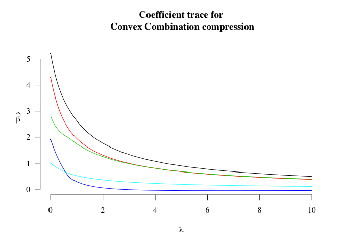

<!-- README.md is generated from README.Rmd. Please edit that file -->
R-package `cplr`
================

This package implements the simulations and data analysis examples for compressed and penalized linear regression as in (Homrighausen and McDonald, 2017). Essentially, the design matrix is premultiplied by a sparse matrix, reducing the number of available observations from *n* to *q*. However, the addition of a ridge penalty results in estimates of the true coefficient vector with lower mean-squared error, even relative to ridge regression (in some cases). The result is improved computation and better statistical accuracy.

Installation
------------

1.  If not already installed, use

``` r
install.packages("devtools")
```

1.  Install the current version of this package with

``` r
devtools::install_github("dajmcdon/cplr")
```

Minimal example
---------------

``` r
n = 100
p = 5
q = 50
X = generateX(n, diag(1,p), 'rnorm')
Y = generateY(X, p:1, 'rnorm')
out = compressedRidge(X, Y, 'convexComb', q=q, lam.max=10)
plot(out,xlab=bquote(lambda),ylab="",las=1,bty='n',lty=1,ylim=c(0,5.5),
     main='Coefficient trace for\n Convex Combination compression', family='serif')
mtext(bquote(widehat(beta)), 2, line=2, las=1)
```


